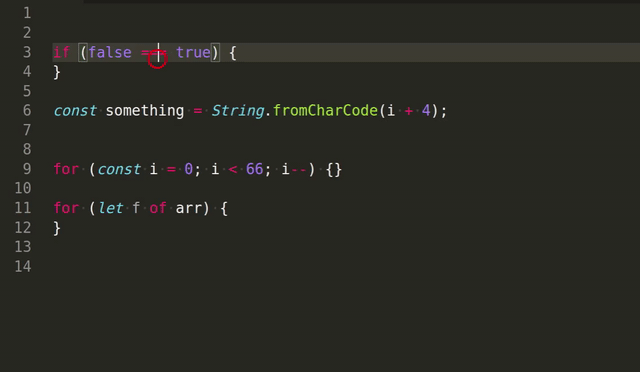

# Flipper

Flipper is [Visual Studio Code](code.visualstudio.com) extension to flip things around.

## Features



- Turn `true` to `false`, bigger than sign (`>`) to
  smaller than sign (`<`) and many more.
- Increase\decrease numbers.

## Extension Settings

This extension add the following commands:

- `flipper.flipUp`: Flip up command - Shortcut: <kbd>Alt</kbd>+<kbd>A</kbd>
- `flipper.flipDone`: Flip Done command - Shortcut: <kbd>Alt</kbd>+<kbd>Z</kbd>

To change the default shortcuts copy the following snippet to `keybindings.json` and modify it as you like

```json
{ "key": "alt+a", "command": "flipper.flipUp" }
{ "key": "alt+z", "command": "flipper.flipDone" }
```

## Release Notes

### 1.0.0

Initial release
